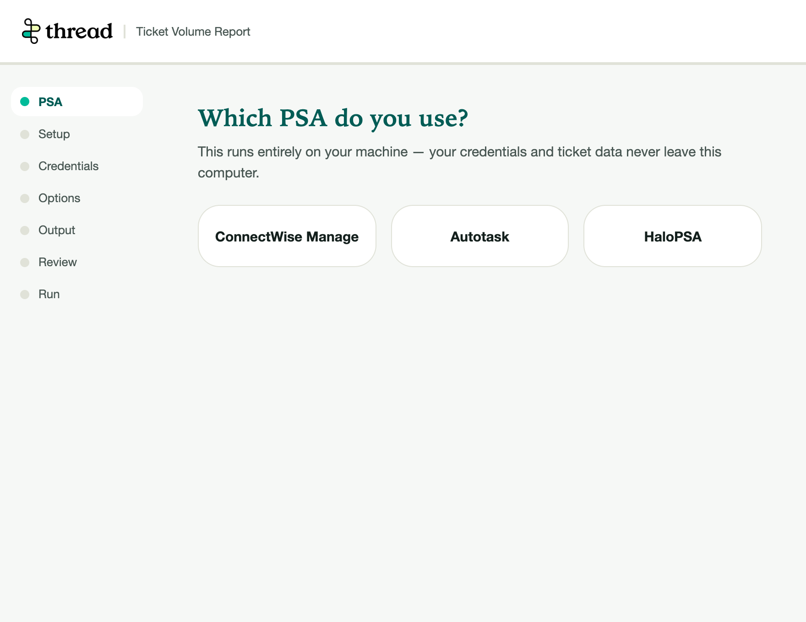
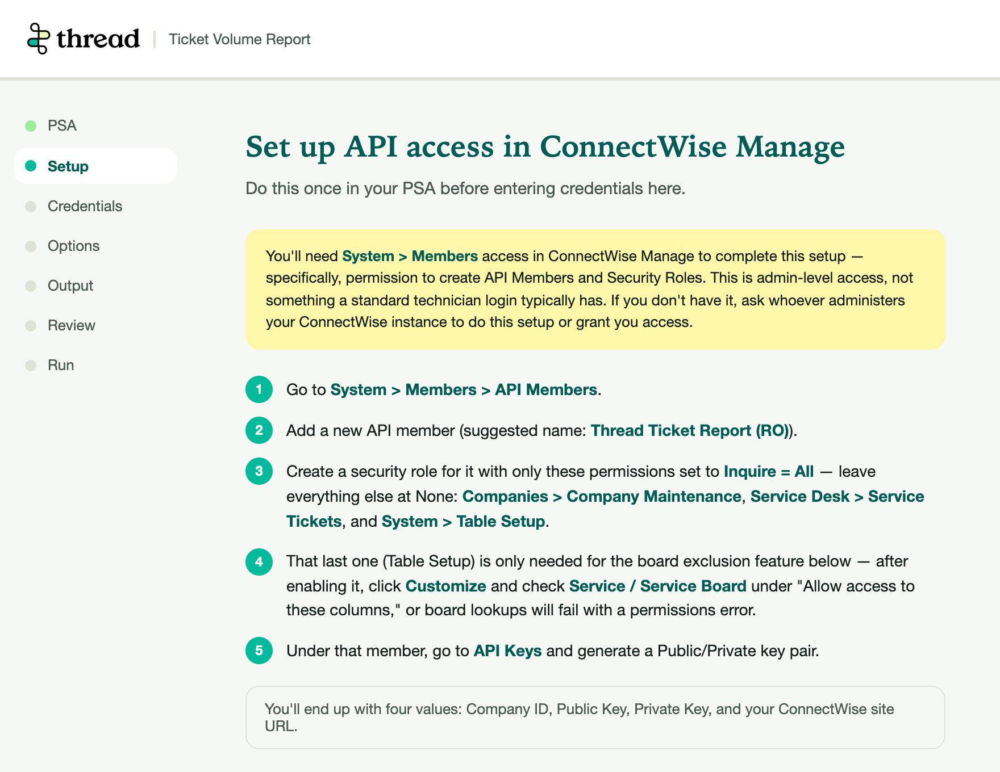
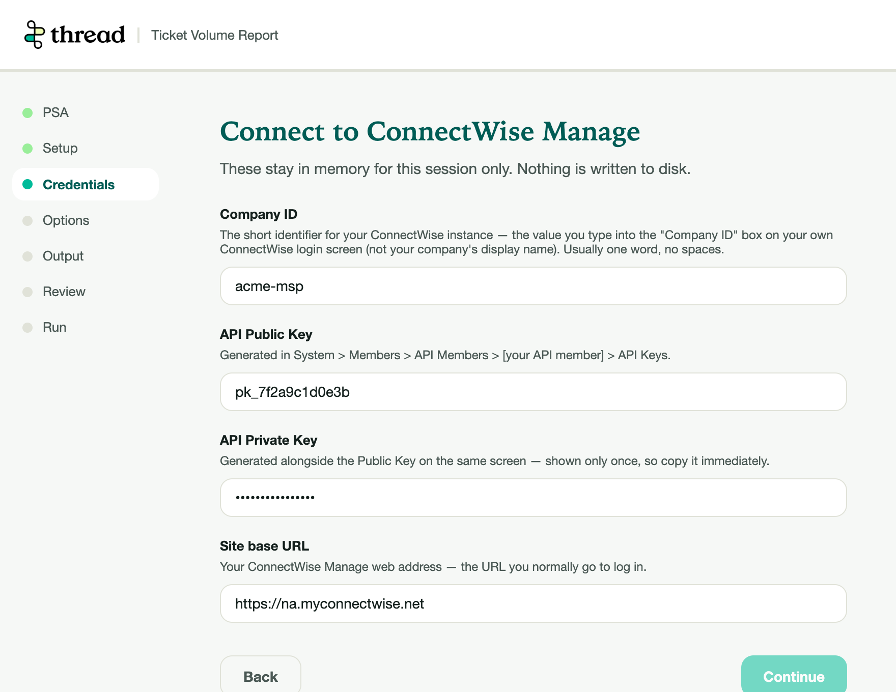
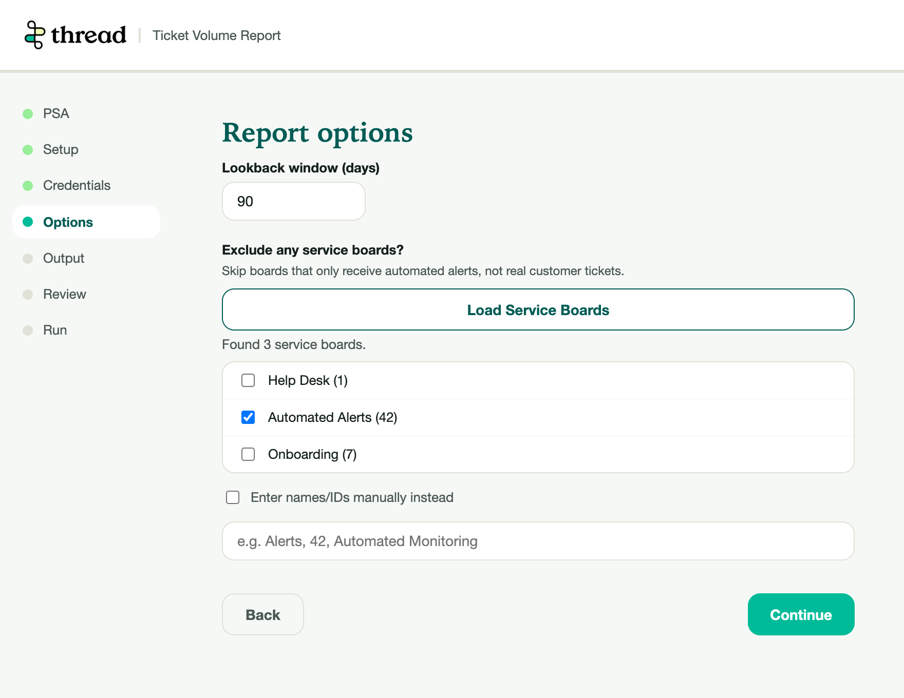
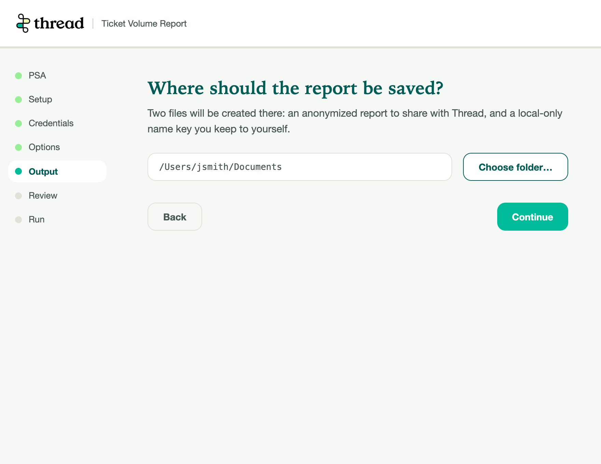
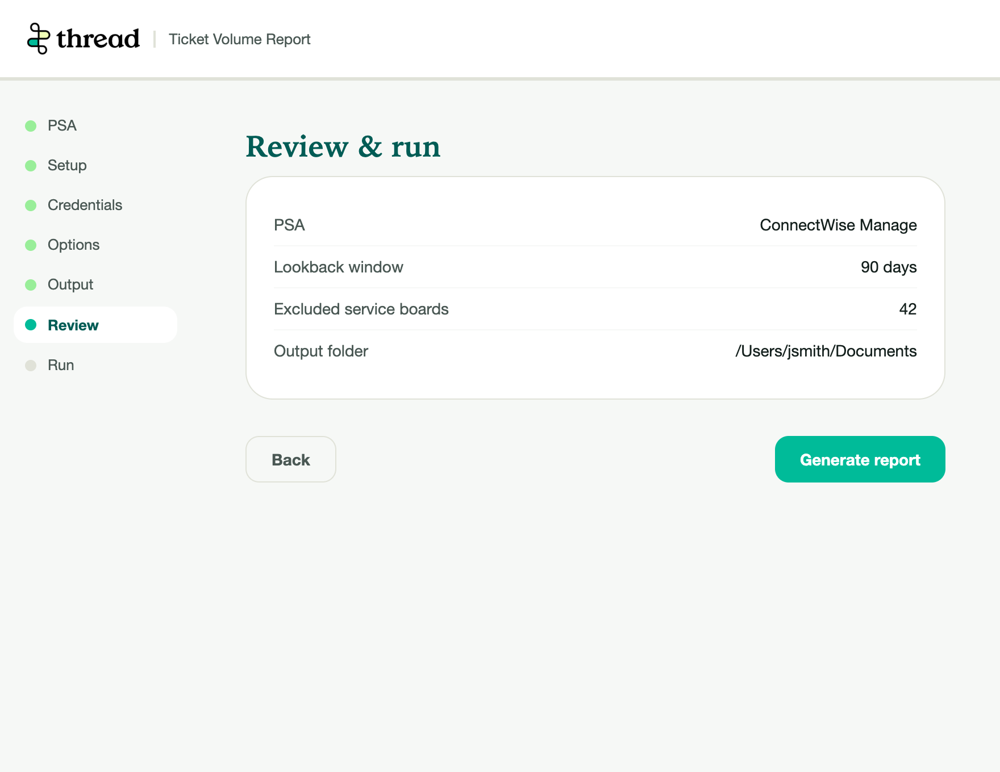
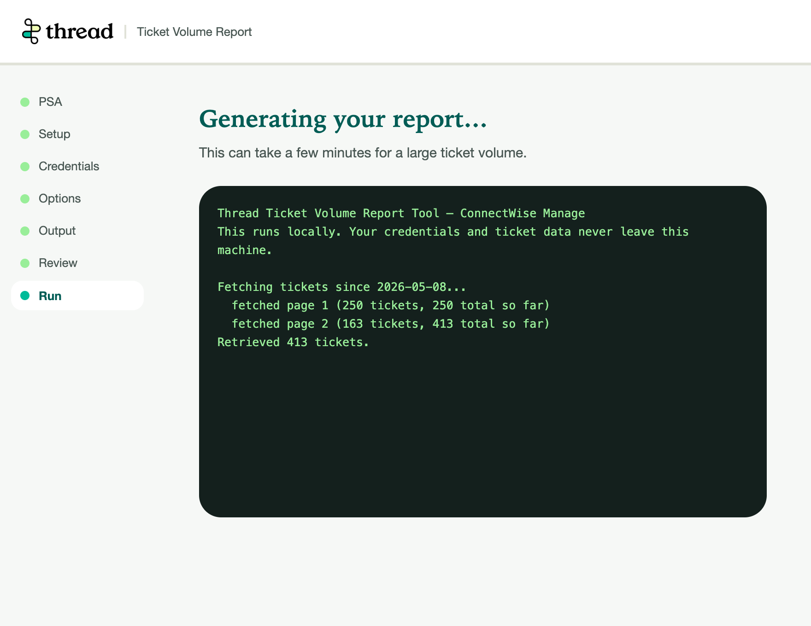
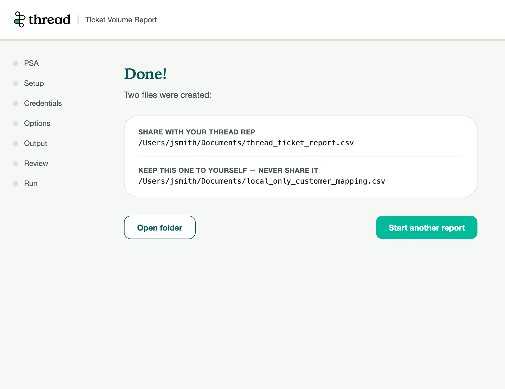

# Thread Ticket Volume Report — Desktop GUI

A point-and-click wizard around the `connectwise/`, `autotask/`, and `halo/`
connector scripts, for anyone who'd rather not run things from a terminal.

This window doesn't talk to any PSA API itself. It only launches the same
connector script you'd otherwise run by hand, passing it your credentials
and your chosen output folder — the actual ticket-fetching logic is
unchanged.

## Running it

```bash
# Windows
python -m pip install -r requirements.txt
python gui\app.py

# macOS
python3 -m pip install -r requirements.txt
python3 gui/app.py
```

## What it does, step by step

**1. Pick your PSA** (ConnectWise Manage, Autotask, or HaloPSA).



**2. Follow the in-app setup instructions.** Before asking for credentials,
the wizard shows the exact admin screens to visit in your PSA to create a
read-only API user/application — condensed from that PSA's own README
(`connectwise/README.md`, `autotask/README.md`, `halo/README.md`), including
the permission gotchas that aren't obvious from the PSA's UI alone.



**3. Enter your credentials.** Every field has help text explaining what it
is and exactly where to find or generate it — no need to cross-reference a
separate README while filling this in.



**4. Choose a lookback window and, optionally, exclude boards.** A "Load"
button fetches your PSA's actual boards/queues/teams so you can check off
ones that only receive automated alerts rather than real customer tickets
(with a manual name/ID fallback if that lookup fails).



**5. Choose a folder for the output files**, via your OS's native folder
picker.



**6. Review your selections** before running anything.



**7. Generate the report** — progress streams live into the window as the
connector script runs.



**8. Two files land in your chosen folder:**
- `thread_ticket_report.csv` — anonymized counts, safe to share with Thread.
- `local_only_customer_mapping.csv` — the real names behind each label.
  **Never share this one.**



## Credential handling

Credentials you type are held in memory for this session only and are
never written to disk. Each time you generate a report, they're passed to
the connector script as environment variables for that one subprocess call.

One residual risk worth knowing about, since this tool's whole pitch is
being small and transparent: on any OS, another process running as your
same user account can inspect a running process's environment variables
(e.g. Process Explorer on Windows, `/proc/<pid>/environ` on Linux). That's
a property of passing secrets via subprocess environment variables in
general, not something specific to this GUI — the same is true any time you
set these as env vars yourself before running a script from a terminal.

## Notes

- This folder is an additive wrapper — it doesn't change how the connector
  scripts themselves work, and doesn't need to be used at all if you'd
  rather run a connector's `.py` file directly per its own README.
- Packaging this into a standalone Windows `.exe` / macOS `.pkg` is a
  separate, not-yet-started effort (see the root `CLAUDE.md`), blocked on a
  code-signing decision. For now, running it requires Python installed,
  same as the connector scripts.
